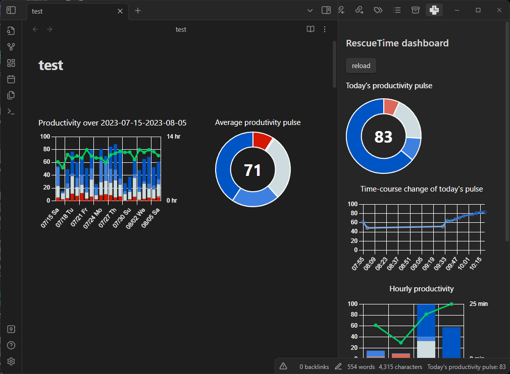

# RescueTime Obsidian Plugin

View your activity logs from RescueTime in Obsidian.




## Installation

### Prerequisite
- RescueTime Account and Apps in your devices [Install here](https://www.rescuetime.com/get_rescuetime)
- Obsidian Desktop Client > v 0.13.0 [Install here](https://obsidian.md/)
> [!NOTE]
> This plugin is compatible only with Obsidian desktop clients, but not with mobile.

### Download RescueTime Obsidian Plugin

You can download manually only as of 2023/10/02, since this plugin is not approved by Obsidian Team yet.

#### Download manually


1. Download `rescuetime-<latest-version>.zip` from [the latest release](https://github.com/Tatz884/RescueTime-Obsidian/releases/latest/)
2. Unpack the zip in `<vault>/.obsidian/plugins/rescuetime`
3. Reload Obsidian (CTRL + R)
4. Disable safe mode.
5. Enable `RescueTime` plugin.


#### Download from community plugin list (NOT available yet)


1. Open the setting tab at the bottom left of your Obsidian client.
2. In "Option", click "Community Plugins".
3. Click "Browse", then search for "RescueTime", and install it.
4. Disable safe mode, and enable "RescueTime" plugin.

To display the data from RescueTime in Obsidian, you need to set API token in the plugin setting - see below.

### Set API token


1. Get API token from [API management page of RescueTime](https://www.rescuetime.com/anapi/manage). Go to "Create a new API key" with a reference label that you can type anything (say, "obsidian integration"). You don't have to change "Allow queries from:". Click "Activate this key" and copy the key.


2. In the setting tab, now "Community plugins" has 'RescueTime'. Paste the copied key in "API token".
3. To test API connection, click "connect" in "API connection test".

That's it! Now you should be able to view the data from RescueTime.

## View RescueTime dashboard for today


Click "Expand" icon at the top right corner to expand the right pane and find the RescueTime icon.
All graphs are based on the data today.
> [!NOTE]
> Your RescueTime clients send data to the RescueTime server every 30 minutes for free users, and 3 minutes for pro users. Thus, you will get the data update with these intervals.

## View RescueTime data for the time period specified by you


If you type the code block with the following format, then it will turn into the graphs showing the data over the period defined by you.
`````markdown
```rescuetime
FROM YYYY-MM-DD TO YYYY-MM-DD
```
`````
> [!NOTE]
> Currently, this code block only supports the time periods spanning less than or equal to 31 days. Also you need to specify the time range starting 92 or less days before today. Querying the period 93 or more days ago will require RescueTime Pro subscription and the developer does not have subscription...
