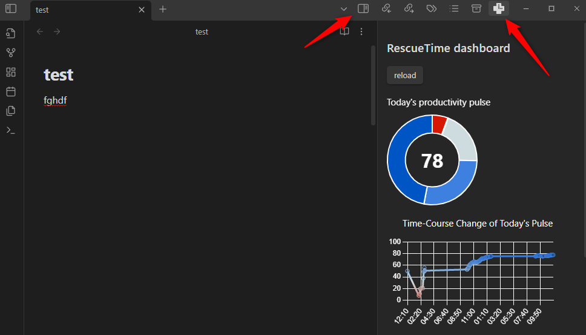

# RescueTime Obsidian Plugin

View your activity logs from RescueTime in Obsidian.

## Installation

### Prerequisite
- RescueTime Apps in your devices [Install here](https://www.rescuetime.com/get_rescuetime)
- Obsidian Desktop Client > v 0.13.0 [Install here](https://obsidian.md/)
> [!NOTE]
> This plugin is not compatible with Obsidian mobile clients.
### Install RescueTime Obsidian Plugin

1. Open the setting tab at the bottom left of your Obsidian client.
2. In "Option", lick "Community Plugins" .
3. Click "Browse", then search for "RescueTime", and install it.
4. Enable "RescueTime" plugin. 

To display the data from RescueTime in Obsidian, you need to set API token in the plugin setting - see below.
### Set API token

1. Get API token from [API management page of RescueTime](https://www.rescuetime.com/anapi/manage). Go to "Create a new API key" with a reference label that you can type anything (say, "obsidian integration"). You don't have to change "Allow queries from: ". Click "Activate this key" and copy the key.
   

2. In the setting tab, now "Community plugins" has 'RescueTime'. Paste the copied key in "API token".
3. To test API connection, click "connect" in "API connection test".

That's it! Now you should be able to view the data from RescueTime.

## View RescueTime data

Click "Expand" icon at the top right corner to expand the right pane and find the RescueTime icon.
### The data graph (as of v 0.1.0)

#### Today's productivity pulse chart

The chart tracks the change of today's productivity pulse.
Your RescueTime clients sends data to the RescueTime server every 30 minutes for free users, and 3 minutes for pro users. Thus, you will get the data update with these intervals.

#### Breakdown by productivity doughnut chart

The chart shows the present productivity pulse and the percentages of each productivity score ("Very productive", "Productive", "Neutral", "Distracting", "Very distracting") today.

#### Hourly productivity panels

The panel shows the breakdown by productivity every hour.

#### Category vs Time Spent panel

The panel shows the top 10 categories you have worked on today.
> [!NOTE]
> The shown categories are sub categories, and different from top-level categories. See [Manage categories](https://www.rescuetime.com/categories) in your RescueTime setting for how your sub categories correspond to top-level categories.
